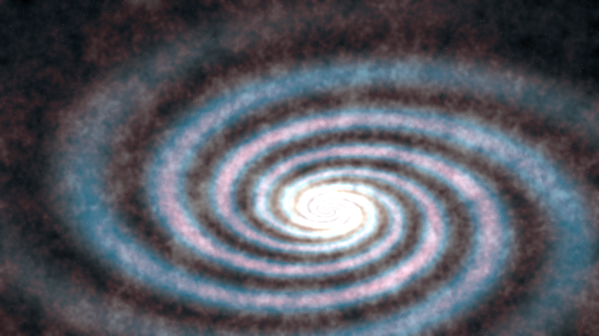
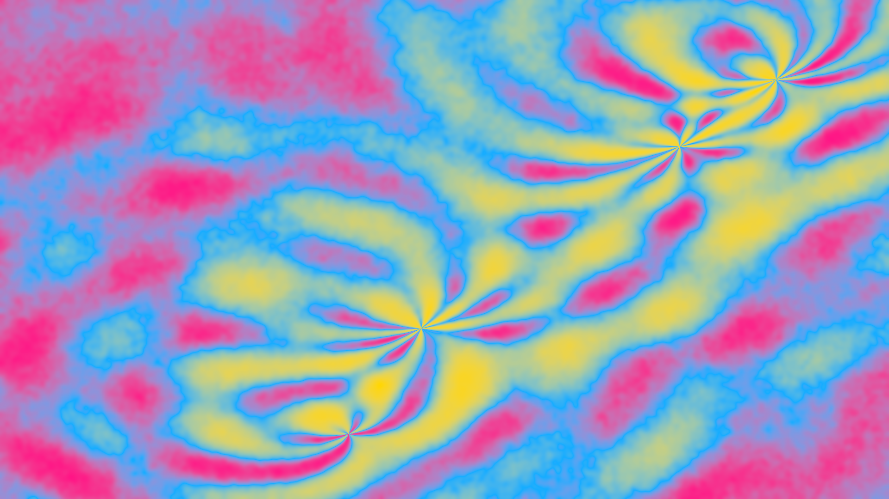

# Cosmic-Wallpaper-Generator
It may be heavily vibe-coded, but it does a remarkable job at generating wallpapers


## How to use
1. First create a Python virtual environment however you please (or don't at all).
2. Enter the Python environment (or skip this step)
3. Then install these packages with this command `pip install Pillow numpy scipy`
4. Then run the script to see the options and how to use it. `python wallpaper_gen.py`


## Examples

###### Cyan Nebula
```bash
python wallpaper_gen.py --width 1920 --height 1080 --style nebula --seed 1720106352 --out cyan-galaxy.png --colors #21aacc #aacc21 #21ccaa
```


###### Cotton Candy Galaxy
```bash
python wallpaper_gen.py --width 1920 --height 1080 --style cosmic --seed 66907707 --out cotton-candy-galaxy.png --expand interpolate --expand-count 4 --colors #5bcefa #f5a9b8 #ffffff
```


###### Cool Lava
```bash
python wallpaper_gen.py --width 1920 --height 1080 --style lava --seed 1251825976 --out cool-lava.png --colors #D60270 #9B4F96 #0038A8
```


###### Psychedelic
```bash
python wallpaper_gen.py --width 1920 --height 1080 --style tiedye --out psychedelic.png --seed 397828539 --colors #FF218C #FFD800 #21B1FF
```

